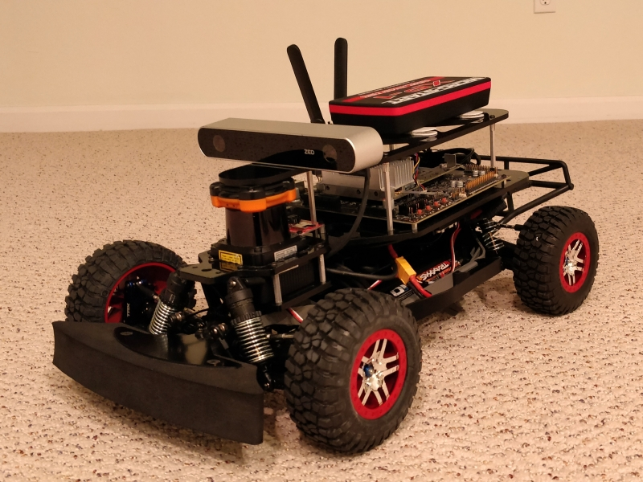

# Jetson RacecarX

An Autonomous Driving Car based on MIT-RaceCar using Jetson-TX2.

The goal of this work till now as **the 1st stage** is to replicate the work in MIT's Autonomous Driving class, including

- Hardware Building
- Software Installation
- ROS Teleoperation
- Hokuyo 2D Lidar based SLAM using hector_slam
- TBD

After this, I would like to go further and check the great potential of the platform for other research.

Shout out to Jestonhacks, my initial work till now has benefitted from his [**website**](https://www.jetsonhacks.com/racecar-j/) and [**github**](https://github.com/RacecarJ) which has been a bridge with MIT Racecar. Also thank [**MIT RACECAR**](https://mit-racecar.github.io/) for providing such a powerful platform for learning and research.

## Other References

- [RACECAR: A Powerful Platform for Robotics Research and Teaching](https://medium.com/syncedreview/racecar-a-powerful-platform-for-robotics-research-and-teaching-55ca86c8dc8)
- [F1/10](http://f1tenth.org/)
- [Jetson Based Autonomous Race Car – University of Pennsylvania](https://www.jetsonhacks.com/2016/06/13/jetson-based-autonomous-race-car-university-pennsylvania/)
- [What is the difference between RACECAR projects?](https://www.jetsonhacks.com/2017/06/04/what-is-the-difference-between-racecar-projects/)
