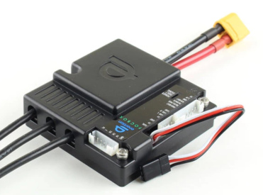
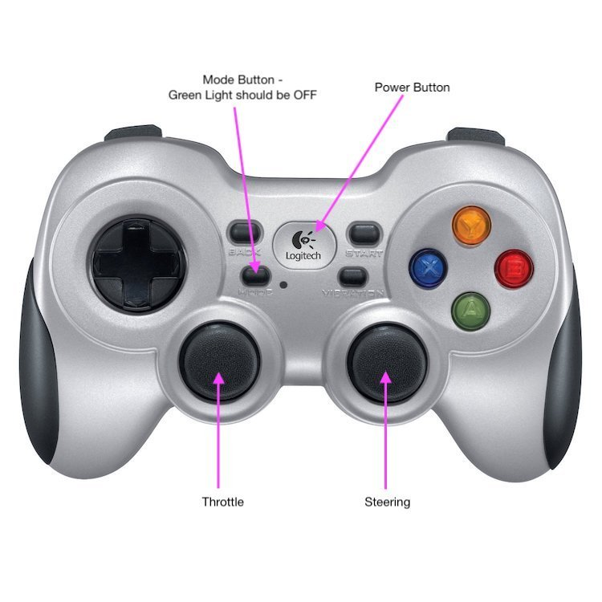

# Jetson RacecarX

An Autonomous Driving Car based on MIT-RaceCar using Jetson-TX2.

The goal of this work till now as **the 1st stage** is to replicate the work in MIT's Autonomous Driving class, including

- Hardware Building
- Software Installation
- ROS Teleoperation
- Hokuyo 2D Lidar SLAM
- TBD

After this, I would like to go further and check the great potential of the platform for other research.

Shout out to Jestonhacks, my initial work till now has benefitted from his [**website**](https://www.jetsonhacks.com/racecar-j/) and [**github**](https://github.com/RacecarJ) which has been a bridge with MIT Racecar. Also thank [**MIT RACECAR**](https://mit-racecar.github.io/) for providing such a powerful platform for learning and research.


## Hardware Assembly

Apparently, there is always a budget issue when it comes to the hardware and sensors. In fact, this has been the highest cost project of myself. I was simply following the official tutorials which saves me time to try and error. For me, if this platform is not for a long term use then it is a great waste.

For those who are interested, I would recommend some other substitutes for sensors like camera and lidar which cost much lower but offer enough performance.

**Material List**

Chassis and Platform
- Traxxas 1/10 Slash 4X4 Brushless Short Course Truck
- Front Bumper Conversion KIT (Optional)
- ["BigMouth" Platform Decks](https://racecarj.com/products/bigmouth-platform-decks)
- [Mechanical Hardware](https://racecarj.com/products/mechanical-hardware)
- [Spring Upgrade](https://racecarj.com/products/spring-upgrade)(Optional)
- [LIDAR Aluminum Heat Sink for Hokuyo UST-10LX](https://racecarj.com/products/aluminum-heat-sink-for-hokuyo-ust-10lx) (Optional)
- [Amazon Basics - 7 Port USB Hub](http://amzn.to/2oWYDnx)
- [XP-1 Power Supply](https://www.amazon.com/gp/product/B0765NDS5P/ref=ppx_yo_dt_b_search_asin_title?ie=UTF8&psc=1)

Compute Unit
- Nvidia Jetson TX2 (or TX1)

Control Unit
- FOCBOX VESC Speed Controller HW V1.7 (an open-source Electronic Speed Control unit)

  

  (or other VESC)

Sensors
- Hokuyo UTM-30LX Scanning Laser Rangefinder LIDAR
- Stereolabs ZED stereo camera
- Sparkfun IMU

Substitutes:
- For Lidar: RPLiDAR A2M8 360 Degree Laser Scanner Kit - 12M Range
- For Camera: Any Web Camera, such as, Logitech HD Pro Webcam C920

**Reference:**

1. [RACECAR/J Chassis Preparation](https://www.jetsonhacks.com/2017/11/30/racecar-j-chassis-preparation/)

2. [RACECAR/J Platform Preparation](https://www.jetsonhacks.com/2018/01/24/3578/)

3. [RACECAR/J Initial Assembly](https://www.jetsonhacks.com/2018/01/28/racecar-j-initial-assembly/)

4. [RACECAR/J Hokuyo UST-10LX Lidar](https://www.jetsonhacks.com/2018/02/20/racecar-j-hokuyo-ust-10lx-lidar/)

  I am using a Hokuyo UTM-30LX 2D Lidar as I happened to find a second-hand one which could be even cheaper and apparently more powerful than a Hokuyo UST-10LX. But I also I have given the price on mounting it. I didn't expect that the size of UTM-30LX is bigger than UST-10LX and I had to spend hours to cut the square hole to fit the size.

  As in the article, the Lidar requires an exclusive cable for powering. Some soldering work needs to be done to make a splitter power output from the power bank. The Lidar will share power input with the Jetson TX2.

  Differing with UST-10LX, UTM-30LX uses an USB cable for data transferring which saves our effort to set up network as in the article.

## Experiments

1. ROS Teleoperation

  Logitech F710

  
  <p></p>
  
  <p></p>

  Dependencies:

  - joystick package

    ```
    $ sudo apt-get install joystick
    ```

  - racecar package: https://github.com/mit-racecar/racecar.git

  Run:

  ```
  $ cd racercar-ws
  $ source devel/setup.bash
  $ roslaunch racecar teleop.launch
  ```

  Reference:

  - [RACECAR/J Software Install](https://www.jetsonhacks.com/2018/08/19/racecar-j-ros-teleoperation/)

2. Hokuyo 2D Lidar SLAM

  Hardware: Hokuyo UTM-30 Lidar

  Software: Ubuntu 16.04, ROS Kinetic

  Source Code: https://github.com/xpharry/hokuyo-hector-slam.git

  Run:

  ```sh
  $ roslaunch hokuyo_hector_slam hector_hokuyo.launch
  ```

## Other References

- [RACECAR: A Powerful Platform for Robotics Research and Teaching](https://medium.com/syncedreview/racecar-a-powerful-platform-for-robotics-research-and-teaching-55ca86c8dc8)
- [F1/10](http://f1tenth.org/)
- [Jetson Based Autonomous Race Car – University of Pennsylvania](https://www.jetsonhacks.com/2016/06/13/jetson-based-autonomous-race-car-university-pennsylvania/)
- [What is the difference between RACECAR projects?](https://www.jetsonhacks.com/2017/06/04/what-is-the-difference-between-racecar-projects/)
